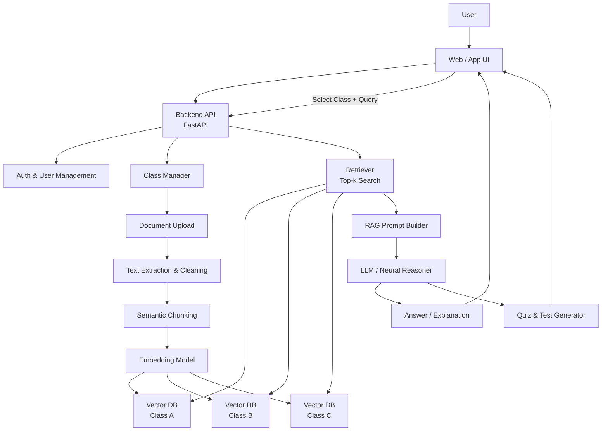

# Personal Multi-Class Neural Study System

A **class-aware, Retrieval-Augmented Generation (RAG) study platform** that allows students to upload lecture materials per course and study using an AI assistant that is **strictly grounded in their own notes**.

Each class operates as an **isolated knowledge universe**, ensuring zero information leakage between courses and reliable, exam-focused responses.

**Built for students who want answers they can trust.**
---

## Project Goal

The goal of this system is to enable serious academic studying by combining:

- Class-scoped document ingestion
- Neural embeddings and vector search
- Retrieval-Augmented Generation (RAG)
- Quiz and exam-style question generation

> If the information does not exist in your uploaded lecture materials, the system will explicitly say so.

This project is designed for:
- Exam preparation
- Long-term personal study
- Capstone-level or portfolio-quality ML + systems work

---

## Core Features

### Multi-Class Management
- Create, rename, and delete classes (courses)
- Each class maintains its own:
  - Uploaded documents
  - Embeddings
  - Vector database / namespace

### Document Ingestion
Supported formats:
- PDF
- PPT / PPTX
- DOCX
- TXT

Capabilities:
- Clean text extraction
- Semantic chunking
- Metadata preservation (class, lecture number, topic, sections)

### Neural Knowledge Representation
- Converts lecture content into vector embeddings
- Stores embeddings in **class-isolated vector databases**
- Efficient top-k similarity search

### RAG-Based Study Interface
- User must select a class before querying
- Retrieval is restricted to the selected class
- LLM answers are grounded strictly in retrieved chunks
- Explicit handling of missing or unsupported information

### Quiz & Testing Engine
- Generates:
  - Recall questions
  - Conceptual questions
  - Exam-style problems
- Quiz scope:
  - Entire class
  - Specific lectures
  - Specific topics
- Explanations reference lecture material directly

---

## System Architecture

### High-Level Architecture Diagram

---

## Tech Stack

### Backend & Infrastructure
- **Language**: Python
- **API Framework**: FastAPI
- **Authentication**: JWT or session-based
- **Relational DB**: PostgreSQL or SQLite

### Document Processing
- `pdfplumber` / `PyPDF2`
- `python-pptx`
- `python-docx`

### Neural & ML Components
- **Embeddings**:
  - SentenceTransformers
  - OpenAI embeddings (optional)
- **Vector Databases**:
  - FAISS (local)
  - Chroma (persistent)

### Reasoning Layer
- OpenAI GPT models
- Local LLMs (Mistral, LLaMA via Ollama)

### Frontend (Optional)
- Streamlit (rapid prototyping)
- React + REST API (production-style)

---

## Minimum Requirements

### Knowledge
**Required**
- Python programming
- Linear algebra basics (vectors, dot products)
- ML fundamentals (embeddings, similarity search)

**Recommended**
- Transformers and attention
- Prompt engineering
- Database design
- LLM orchestration

### Hardware
**Minimum**
- CPU-only machine
- 16 GB RAM recommended
- Local storage for documents and embeddings

**Recommended**
- NVIDIA GPU (8–16 GB VRAM)
- CUDA-compatible environment

> The core RAG system does **not** require a GPU.

---

## Recommended Build Order

### Phase 1 — Foundations
1. User and class abstraction
2. Document upload and parsing
3. Chunking and metadata tagging

### Phase 2 — Neural Memory
4. Embedding generation
5. Class-specific vector indexes
6. Similarity search

### Phase 3 — RAG Interface
7. Retriever + LLM integration
8. Strict class-scoped prompting
9. Q&A interface

### Phase 4 — Quiz Engine
10. Quiz generation
11. Lecture- and topic-specific tests
12. Grounded explanations

### Phase 5 — Advanced (Optional)
13. Student performance tracking
14. Adaptive difficulty
15. Domain-specific fine-tuning

---

## Future Extensions
- Fine-tuned embedding models per course
- Contrastive learning to separate similar classes
- Concept graphs for prerequisite tracking
- Multi-user deployment
- Exportable study guides and summaries

---

## Why This Project Matters

This system combines:
- Software engineering
- Neural information retrieval
- Applied machine learning
- Educational tooling

It is designed to be **rigorous, trustworthy, and extensible**, making it suitable for:
- Academic study
- Capstone projects
- ML + systems portfolios

---

**Built for students who want answers they can trust.**
